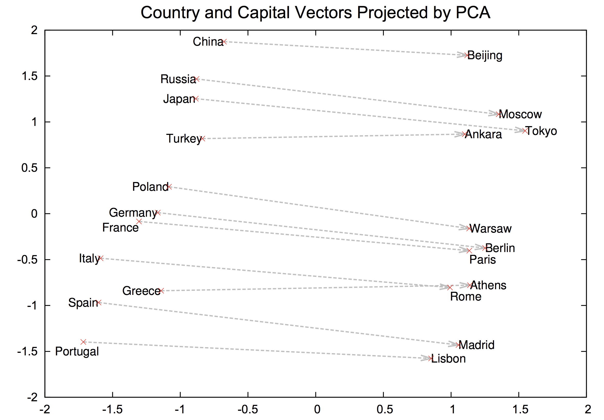

#### *What is this about?*
In this post, I walk through a typical workflow using word vectors to analyze unstructured text documents. I also show how a dimensionality reduction technique like TSNE can be leveraged to visualize patterns in the vector space.  
#### *Why should I care?*
If you know nothing about word vectors, they may seem mysterious, complex, or even magical. While these points may be true, they are also really simple, powerful, and easy to use.
#### *Want to learn more?*
This blog post is awesome, but you'll learn a lot more from a book than from me... If you're interested in learning more about natural language processing, check out these books on Amazon:

## Background
In my time as an analytics professional, I've been in a lot of conversations about how best to analyze text. I am consistently surprised at the lack of familiarity with word vectors.

In 2013, Tomas Mikolov et al from Google made a big (lasting) splash with their introduction of the Skip-gram method for vectorizing words -*[Efficient Estimation of Word Representations in
Vector Space](https://arxiv.org/pdf/1301.3781.pdf)*- followed shortly after by their NIPS paper *[Distributed Representations of Words and Phrases and their Compositionality. ](https://papers.nips.cc/paper/5021-distributed-representations-of-words-and-phrases-and-their-compositionality.pdf)*

Though not the first known use of word vectors, their work was seminal because of their impressive performance, and the intrigue their results generated. They demonstrate the consistent relationship between like words in vector space:

    

They also demonstrated the impressive learned mathematical properties of their vectors, such as:
* `vector(king) - vector(man) + vector(woman) ≈ vector(queen)`
* `vector(copper) - vector(Cu) + vector(zinc) ≈ vector(Zn)`
* `vector(Einstein) - vector(scientist) + vector(Messi) ≈ vector(midfielder)`

[DIAGRAM HERE + DESCRIPTION OF HOW IT WORKS]

Needless-to-say, since 2013, many advancements have been made in the development of word vectors, and they have been ubiquitous with the latest research in NLP.
